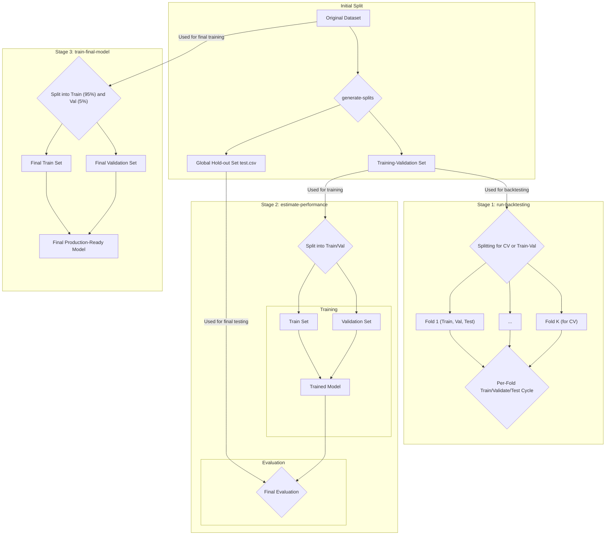

# Fine-tuning Transformer (and not only) models for sentiment analysis

This project provides a CLI application to fine-tune a series of NLP models for sentiment analysis. It uses a cross-validation strategy to train and evaluate the models.

# ML Model lifecycle 
Application handles two stages of ML Model life cycle:
- Model development
- Model usage

## Model development
- creating code many ML Models in separate folders
- create an ML experiment for a given training dataset
- evalute ML Models' perfomance using selected experiment
- compare ML Models's performance for given experiment

## Model 
- train selected ML Model on the whole train dataset
- predict using trained ML Model on a new predict dataset

# Main technologies and technology stack

- **Python 3.11+**: The main programming language.
- **Typer**: For building the CLI interface.
- **Loguru**: For logging.
- **Pandas**: For data manipulation.
- **Scikit-learn**: For basic ML tasks, including data splitting and evaluation.
- **Transformers**: A library from Hugging Face for working with Transformer models (e.g., RoBERTa, Gemma).
- **PEFT (Parameter-Efficient Fine-Tuning)**: For efficient model tuning.
- **TRL (Transformer Reinforcement Learning)**: For training models using reinforcement learning.
- **Pytest**: For writing and running tests.
- **uv**: For managing dependencies and the virtual environment.

# How to use the CLI

The application is now using a CLI based on `typer`. The main entry point is the `cli` command.

**Note:** All commands should be run with the `uv run` prefix. For example: `uv run cli list-models`.

## Data Generation

You can generate synthetic data for your experiments using a Gemma model with few-shot prompting.

```bash
uv run cli data-generate --name <output_name> [--examples-per-sentiment <count> | --distribution-from-file <path> --total-examples <total>] [--lang <language_code>]
```

*   `--name`: (Required) The name of the output file (without .csv extension).
*   `--examples-per-sentiment`: Generate a fixed number of examples for each sentiment.
*   `--distribution-from-file` & `--total-examples`: Generate a total number of examples with a sentiment distribution copied from an existing file.
*   `--lang`: (Optional) The language for the generated text (e.g., 'pl', 'de'). Defaults to 'en'.

## Model Validation and Training Strategy

Below is a diagram illustrating the data splitting strategy across the entire model lifecycle.



The application provides a robust, multi-stage process for training and validating models to ensure reliable performance and to produce a production-ready model. The lifecycle is divided into three key command-line actions:

1.  `run-backtesting`
2.  `estimate-performance`
3.  `train-final-model`

This entire process begins after an initial, global data split is performed by `generate-splits`, which separates the original dataset into a large **training-validation set** and a smaller, global **hold-out set (`test.csv`)**. This hold-out set is crucial as it remains untouched until the final performance estimation, simulating brand new, unseen data.

### Stage 1: `run-backtesting`

**Goal:** To get a stable and reliable performance estimate for a model configuration. This process protects against a single "lucky" or "unlucky" data split, giving a more accurate picture of how the model is likely to perform.

**Data Splitting:** The backtesting process uses only the **training-validation set** (the original data minus the global hold-out set). The splitting strategy depends on the chosen method:

-   **`cv` (Cross-Validation) Strategy:** The training-validation set is divided into K folds (e.g., 5). Each fold is then further split into three parts: a `train` file, a `val` file, and a `test` file for that specific fold.
-   **`train-val` Strategy:** The training-validation set is split just once into three files: `train.csv`, `val.csv`, and `test.csv`.

**Execution:** The process iterates through the folds (K times for `cv`, once for `train-val`). In each iteration:

1.  **Training:** A new model is trained from scratch on the fold's `train` set.
2.  **Validation:** The fold's `val` set is used during training to monitor performance and prevent overfitting (e.g., via early stopping).
3.  **Testing:** After training, the model's performance for that fold is evaluated on the fold's dedicated `test` set. This data was not used in any part of the training or validation process for that fold, ensuring an unbiased evaluation.

**Outcome:** A set of performance metrics (one for each fold). The average of these metrics provides a robust and reliable estimate of the model's expected performance.

### Stage 2: `estimate-performance`

**Goal:** To get a final performance estimate on the global hold-out data. This simulates how the model would perform on brand new, unseen data in a production environment.

**Data Splitting:** This stage again uses the **training-validation set**. It is split once more into a new `train.csv` and `val.csv` (stored in the `performance_estimation` directory).

**Execution:**

1.  **Training:** A single model is trained from scratch on the new `train.csv`.
2.  **Validation:** The corresponding `val.csv` is used for monitoring during the training process.
3.  **Testing:** After training, the model is evaluated on the **global hold-out set (`test.csv`)**—the data that was set aside at the very beginning and has been completely untouched until this point.

**Outcome:** A single, final performance score that serves as the best estimate of the model's real-world performance.

### Stage 3: `train-final-model`

**Goal:** To produce the final, production-ready model artifact. The objective is not to evaluate performance, but to train the best possible model using all available data.

**Data Splitting:** This is the only stage that uses the **entire original dataset**. The full dataset is split just once into a very large `train.csv` (e.g., 95% of the data) and a very small `val.csv` (e.g., 5%). There is no test set.

**Execution:**

1.  **Training:** A single model is trained from scratch on the large `train.csv`.
2.  **Validation:** The small `val.csv` is used solely for monitoring the training process.
3.  **No Testing:** There is no evaluation step. The model's performance is assumed to be similar to what was determined in the `estimate-performance` stage.

**Outcome:** A single, trained model saved to a file. This is the final artifact ready for deployment and for use with the `predict-new` command.

## Extra Functionality

### List all available models

To see the list of all available models you can run the following command:
```bash
uv run cli list-models
```

### List all available experiments

To see a summary of all experiments and their status, run:
```bash
uv run cli list-experiments
```

# Adding a New Model - Step by Step

The application dynamically loads all model configurations from the `model_configs/` directory. To add a new model, you simply need to add a new JSON configuration file. You do not need to edit `models_config.py`.

### Scenario A: New Configuration for an Existing Model

This is the most common scenario, where you want to test a different pre-trained model or use different hyperparameters with an existing model implementation (like `RobertaModel`).

**Example: Adding `bert-micro-base`**

1.  **Create a JSON Configuration File**

    Create a new file in the `model_configs/` directory named `bert-micro-base.json`. The name of this file becomes the model identifier you use in the CLI.

2.  **Define the Configuration**

    Add the following content to the file. This tells the application to use the existing `RobertaModel` class but load the `boltuix/bert-micro` pre-trained weights from Hugging Face.

    ```json
    {
        "module_path": "models.roberta.model",
        "class_name": "RobertaModel",
        "model_name": "boltuix/bert-micro",
        "training_arguments": {
            "num_train_epochs": 1,
            "per_device_train_batch_size": 8,
            "gradient_accumulation_steps": 1,
            "learning_rate": 2e-5,
            "logging_steps": 10
        }
    }
    ```

3.  **Run the Model**

    That's it! The new model is now available. You can see it by running `uv run cli list-models` and use it in experiments with `--model-config-name bert-micro-base`.

### Scenario B: Adding a Completely New Model Implementation

If you are creating a new model architecture, you need to create a new Python class first.

1.  **Create the Model Implementation**

    -   Create a new directory, e.g., `models/my_new_model/`.
    -   Inside, create a `model.py` file.
    -   In `model.py`, define a class (e.g., `MyNewModel`) that inherits from `ModelInterface` (from `mlops.model_interface`) and implements the required `train` and `predict` methods.

2.  **Create the JSON Configuration File**

    -   Create a new file in `model_configs/`, for example, `my-new-model.json`.
    -   Define its configuration, making sure the `module_path` and `class_name` point to your new implementation:

        ```json
        {
            "module_path": "models.my_new_model.model",
            "class_name": "MyNewModel",
            "model_name": "name-of-base-model-on-huggingface",
            "training_arguments": { ... }
        }
        ```

3.  **Run the Model**

    Your new model is now ready to be used in experiments with `--model-config-name my-new-model`.

# Folder Structure

-   `artifacts/`: Contains all outputs from experiments, such as data splits, predictions, and trained models.
-   `data/`: Contains the data generator module.
-   `model_configs/`: Contains JSON configuration files for each model.
-   `models/`: Contains the Python source code for each model implementation.
-   `mlops/`: This is the core of the application.
    -   `app.py`: The main `Application` class, acting as a facade that orchestrates calls to various services.
    -   `runner.py`: Contains the `ExperimentRunner` class, which holds the core logic for executing experiment steps (training, prediction, evaluation).
    -   `experiment_service.py`: Manages experiment-related data, providing paths and data splits for different run types.
    -   `model_interface.py`: Defines the abstract interface that every model must implement.
    -   `pipeline.py`: Contains classes for building data processing pipelines.
    -   `splitting.py`: Handles the logic for splitting datasets.
-   `main.py`: The main entry point for the CLI application, built with Typer. Defines the `cli` app.
-   `tests/`: Contains all the tests for the application.
-   `pyproject.toml` & `uv.lock`: These files manage the project dependencies and scripts.
